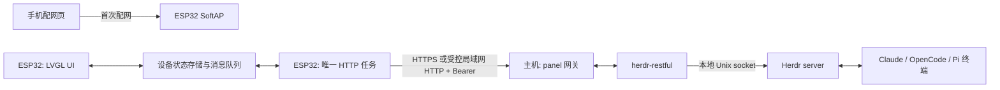
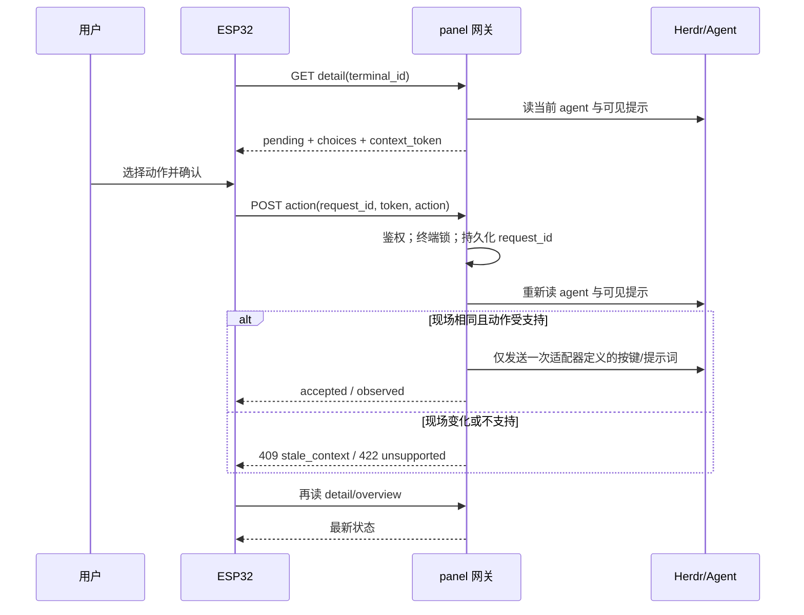

# Herdr 面板系统架构设计

版本：v1 草案（2026-09-30）。本文定义**目标架构**和从现有原型迁移的步骤，配合[产品逻辑](PRODUCT_LOGIC.md)、[UI 设计](UI_DESIGN.md)、[验收清单](ACCEPTANCE.md)使用。硬件仍按仓库现有 ESP32-C6 / 480×480 触摸 AMOLED 假设；实际板卡待核实。

## 1. 结论与架构原则

现有“LVGL 任务 + 一个网络任务 + Herdr REST 包装层”的方向可以保留。问题在于**职责边界不清**：固件拿原始 pane、自己把状态与动作混在一起、直接发终端文本；多个全局缓冲和 `volatile` 标志让 UI/网络线程交换数据；审批没有现场校验、去重和回读。产品级架构采用：

1. **主机做语义，设备做交互。** Herdr 和各 CLI 的审批选项由主机侧 panel 网关解析；ESP32 只渲染网关给出的状态/选项并提交语义动作。
2. **设备只有一个 HTTP 执行者、一个 LVGL 所有者。** HTTP 请求和 JSON 解析只在 `net_task`；LVGL 对象只在 LVGL 任务。通过有界队列和短暂持锁的快照交换数据。
3. **动作按事务思考，承认终端没有事务。** 网关在发键前复验当前提示并记录请求 ID；网络结果不明时不自动重试。`accepted` 与“CLI 已执行”是两个不同结果。
4. **先测内存，再调动画和吞吐。** ESP32-C6 为单核，所有任务最终在同一核上运行；固定核心编号不能改善并行度。显示部分用小块刷新缓冲，不分配整帧。[ESP-IDF FreeRTOS](https://docs.espressif.com/projects/esp-idf/en/v5.1/esp32c6/api-reference/system/freertos.html) · [厂商硬件资料](https://docs.waveshare.com/ESP32-C6-Touch-AMOLED-2.16)

## 2. 现有代码评估

| 现状（代码位置） | 影响 | 目标 |
| --- | --- | --- |
| [`app_main.cpp`](../main/app_main.cpp) 中网络任务既发动作又轮询列表，HTTP 最长等 8 秒 | 某个请求阻塞会延迟所有其它请求；UI 只得到笼统 `sent` | 仍保留一个网络任务，但用队列调度、分请求超时、动作结果状态机。 |
| [`panel_state.c`](../main/panel_state.c) 的输出、toast、连接文字只有 `volatile bool dirty`，没有一致的锁/消息所有权 | 字符串写入和 UI 读取可能交错；dirty 标志可能丢事件 | 快照 store + UI 事件队列；禁止跨任务直接读写这些全局字符数组。 |
| [`ui_panel.c`](../main/ui_panel.c) 的 `s_selected` 是列表下标；输出结果不带请求/终端身份 | 列表变动后可能显示或操作另一会话；旧输出可能落入新详情 | 选中 `terminal_id`；详情请求记录 `server_id`、`terminal_id`、`selection_epoch`，过期响应丢弃。 |
| [`herdr_model.h`](../main/herdr_model.h) 的 24 个记录约 7.5 KB；网络任务有同尺寸局部 `snap`，栈仅 12 KB | 大局部变量占掉大量任务栈；UI、全局、网络至少三份快照 | 网络解析目标放固定静态缓冲；型号字段裁剪；栈按水位测量。 |
| [`herdr_client.c`](../main/herdr_client.c) 每请求分配 24 KB 响应缓冲，再建 cJSON 树 | 峰值堆内存与碎片化不可控；超长响应被静默截断 | 网关限制响应；设备按 Content-Length/实际长度做显式上限检查，复用有界缓冲或流式解析。 |
| [`wifi_connect.c`](../main/wifi_connect.c) 与 [`app_config.c`](../main/app_config.c) 都初始化 NVS；保存配置忽略部分 NVS 返回值 | 启动/保存路径难定位失败，可能错误显示配置成功 | 单一系统初始化；配置验证、`nvs_commit` 返回值和重启流程统一归 `config_service`。 |
| [`provisioning.c`](../main/provisioning.c) 是开放热点 | 家用 Wi-Fi 密码经开放 AP 的 HTTP 页面输入 | 随机临时 WPA2 热点密码，仅在屏幕/配网二维码展示；网关凭据不回显。 |
| 固件通过 pane `send_text` 发送字面量 `allow`/`deny`/`continue` | 不适配不同 CLI 的交互界面；`blocked` 可能是问题而非审批 | 引入带上下文校验的 `/api/v1/panel` 语义网关。 |

这些是代码审查结论，尚未通过真机性能测试；内存数字是从当前结构体/配置推算的量级，最终用构建报告和运行时水位确认。

## 3. 部署与信任边界



- 设备不能直接连 Herdr Unix socket。`herdr-restful` 负责原始 Herdr REST，新增 panel 网关负责面板特有的读模型与安全动作；两者可部署在同一个 FastAPI 进程，别为网关再起一个不必要的 Python 服务。
- Wi-Fi/网络边界和 CLI 决策边界分开。网关靠鉴权拒绝未授权客户端，靠现场校验拒绝过期动作；设备遗失时必须能撤销它的 token。主机管理员通过网关命令生成每设备独立的随机令牌，手机配网页录入，网关仅保存令牌校验值。持有有效 token 的人仍可对真实当前提示作决策，所以“藏住按钮”不是服务端授权。
- 远程主机的发布方式必须明确：优先经过证书验证的 HTTPS 或受控 VPN/隧道；纯 HTTP 仅限可信局域网，不可公网直连。部署说明须包含设备可达的 URL、令牌生成/吊销、网关只启用一个 worker 进程、Herdr socket 权限以及断网后的故障显示。
- 面板对外只有手机配网时的临时 HTTP 服务。配网结束应关闭 SoftAP、DNS、HTTP server 与临时密码的内存副本；正常运行时不开放设备控制端口。
- v1 以**一个 Herdr 主机**为配置单位。切换主机要清除所有 agent 缓存、待处理 token、未完成确认。多主机聚合是单独版本需求，不在 UI 上制造混合列表。

## 4. 主机端模块（新增到 `herdr-restful`）

```text
backend/app/panel/
  api.py                 /api/v1/panel HTTP 路由、鉴权和响应码
  service.py             列表聚合、详情与动作编排
  view_models.py         固定版本、固定长度的设备专用响应模型
  adapters/base.py       AgentPromptAdapter 接口
  adapters/claude.py     Claude 可见审批界面适配
  adapters/opencode.py   OpenCode 可见审批界面适配
  adapters/pi.py         仅已知审批扩展的 Pi 适配
  idempotency.py         request_id 持久化与终端级互斥
```

### 4.1 读取路径

`overview` 每次优先调用 Herdr 的一次 `session.snapshot`（由现有 REST `GET /api/v1/session/snapshot` 转发），关联 agents、panes、workspaces，过滤普通 shell，并投影成最多 24 条紧凑记录。按 `terminal_id` 去重；缺 `terminal_id` 的记录只读且不能执行动作。主机保留 `total_count`。在多设备轮询时可缓存不超过 1 秒，但**动作复验绝不能使用缓存**。

`detail` 根据 `terminal_id` 重新解析最新 pane/agent，然后从 `agent.read(source=visible)` 或 `pane.read(source=detection)` 获取当前底部可见内容。`recent` 只能给人类摘要，不能当审批凭据。适配器返回 `kind`、`summary`、`impact`、`choices`、`source`；不完整或未知版本返回 `unrecognized` 与空选项。网关签发 10 秒上下文 token，绑定主机启动 ID、终端、当前 agent 身份、可见提示指纹与选项。

### 4.2 动作路径



请求 ID **先写入并提交** SQLite 去重表，初始结果为 `uncertain`，再尝试发键；发送结果再更新记录。记录保留至少 10 分钟。同一 ID、同一请求体只返回已记录结果，不能再次发键；同一 ID 携带不同请求体直接拒绝。按 `terminal_id` 加互斥锁，防止两个设备同时响应同一提示；v1 网关只启动一个服务进程，若未来多进程部署，锁必须迁移到共享存储。若进程在“记录请求”与“发键”之间崩溃，恢复后仍是 `uncertain`，也不能自动补发。这是对原始 TUI 输入的保守 *at-most-once* 策略，无法保证“恰好一次”或 agent 一定执行。用户必须重新查看现场后再决策。

鉴权在路由最外层完成。拒绝未认证的 `overview/detail/action`，至少给每台设备独立 token；未来可撤销单设备 token。网关不向设备暴露 raw pane `send_text`、任意按键、关闭 pane 或 Auto 模式切换。原有 `herdr-restful` 通用 API 应只监听 loopback 或置于同一受保护网关后，避免绕过 panel 限制。

### 4.3 Agent 适配接口

```text
inspect(agent_kind, cli_version, visible_text, herdr_status)
    -> PromptCard(kind, summary, impact, choices, evidence)

execute(action, expected_evidence, live_agent)
    -> one explicit Herdr agent.send_keys / agent.prompt sequence

verify(expected_evidence, new_visible_text, new_status)
    -> observed | uncertain
```

每个适配器只支持留有真实 CLI 样本和测试的提示形态。`blocked` 是触发 inspect 的线索，不能单独使按钮可用；Pi 原生没有统一审批窗，没装已知扩展时没有审批适配器。Claude Auto/OpenCode Auto 属主机权限模式，不通过此接口切换。[Herdr 状态/检测](https://herdr.dev/docs/agents/) · [Claude 权限](https://code.claude.com/docs/en/permissions) · [OpenCode 权限](https://opencode.ai/docs/permissions/) · [Pi 安全说明](https://pi.dev/docs/latest/security)

## 5. 固件模块与数据所有权

```text
main/
  app_main.cpp           只负责启动、错误恢复与生命周期
  platform/             BSP、显示、触摸、亮度（可继续复用 components/）
  config_service.c      NVS 初始化/验证/保存；隐藏凭据
  connectivity.c        Wi-Fi STA、SoftAP 配网与连接事件
  panel_api_client.c    唯一 HTTP 客户端；版本/长度/JSON 校验
  panel_model.h         设备专用有界数据结构、状态与动作枚举
  panel_store.c         快照发布/读取；不包含 LVGL 对象
  panel_worker.c        请求队列调度、轮询、退避、动作生命周期
  ui_screens.c          LVGL 页面和局部刷新
  ui_controller.c       导航/确认/手势；向 worker 投递命令
```

名字是目标模块边界，不要求一次性改完物理文件。`main/` 可以先保持现有文件，通过新增接口逐步替换；不要在一个 PR 里同时重写 BSP、配网、网关和全部 UI。

### 5.1 任务和队列

| 执行上下文 | 唯一拥有 | 可调用 | 禁止 |
| --- | --- | --- | --- |
| LVGL adapter/UI task | `lv_obj_t`、导航栈、选中 `terminal_id`、UI 动画 | 从 store 复制只读视图；非阻塞投递命令 | 同步 HTTP、NVS 写入、持有 store 锁期间调用 LVGL。 |
| `panel_worker` FreeRTOS task | HTTP handle、网络定时器、响应解析工作缓冲、动作 `request_id` | 读取 config 副本、调用 config service 保存设置、发布 store、投递 UI 结果事件 | 直接调用 LVGL；从 UI 全局字符数组读数据。 |
| Wi-Fi/ESP event callback | 链路事件 | 设置 EventGroup 位或投递简短事件 | HTTP、复杂 JSON、LVGL、长时间阻塞。 |
| 配网 HTTP/DNS task | 临时 AP/网页 | 字段校验、交给 config service 保存 | 直接改 UI/worker 全局状态；在 HTTP handler 里长时间等待重启。 |

用两个有界入口：`action_q` 容量 1，只收已确认的 `ACTION`；`control_q` 容量 4，收 `OPEN_DETAIL`、`REFRESH`、`RECONNECT`、`SET_DISPLAY_PREF`。`ACTION` 带 `server_id`、`terminal_id`、`context_token`、动作和可选提示词；worker 在取出时生成一次 `request_id` 并保存到动作状态，直到结果确定或标记未知。命令对象用固定大小并标注最大长度。UI 投递使用 **0 ms** 超时；队列满立即显示“忙，请稍后”，不能像现有代码那样在触摸回调中等待 500 ms。重复的 `OPEN_DETAIL/REFRESH` 合并，亮度设置只保留最新值。worker 每次调度先检查 `action_q`，然后处理控制请求和到期轮询；`ACTION` 不合并也不重排。配网 HTTP handler 在配置服务完成 NVS 提交后只发重连事件，不直接改 UI 全局变量。

设备同一时刻只允许**一个全局未决动作**：确认后先用原子状态占位，再入 `action_q`；入队失败立即释放占位。worker 完成或标为 `uncertain` 后释放占位，不能因为队列已经被取空就接受第二个动作。重新操作必须重新打开最新详情，不能把旧确认页当作第二次提交入口。

`ui_evt_q` 建议容量 8，用于一次性的 `ACTION_RESULT`、`CONFIG_RESULT`、`FATAL_ERROR`；动作事件带 `request_id` 和必要时的 `selection_epoch`。持续状态（会话列表、详情、连接）走 `panel_store`，不是把大字符串塞进队列。容量满时，非关键刷新事件可丢弃并靠下一次快照恢复；动作结果必须保留或存入 worker 的结果槽，不能默默丢掉。

ESP32-C6 单核；任务优先级只影响调度，不提供另一个 CPU。保留 adapter 的 LVGL 任务即可，不再另建自己的图形线程。LVGL 官方明确非线程安全，所有对象操作应在 LVGL 回调/定时器内或经同一 adapter 锁保护。[LVGL 9.5 线程说明](https://lvgl.io/docs/open/9.5/integration/overview) · [ESP-IDF 任务文档](https://docs.espressif.com/projects/esp-idf/en/stable/esp32c6/api-reference/system/freertos_idf.html)

### 5.2 Store 与身份规则

网络任务先在私有、静态 `next_snapshot` 中解析完整响应；只有校验成功才在一个 mutex 临界区把它发布到 `panel_store`，增加只用于通知 UI 重绘的 `store_generation`。UI 定时器先在锁内复制**当前页四个摘要 + 选中详情 + 连接状态**到 UI 自有小结构，解锁后再更新 LVGL。不要让 UI 在锁内执行 label 布局或动画。

所选会话身份是 `server_id + terminal_id`，不使用数组下标和旧 `pane_id`。每次切换选中会话、离开详情、切换服务器或重连后，UI 增加 `selection_epoch`。详情请求记录该 epoch 与所选身份；响应回来若 epoch、主机、终端或当前 agent 身份不一致，直接丢弃。**不要拿 `store_generation` 当响应有效性条件**：列表可在详情请求期间正常更新。允许重新解析 `pane_id` 变更后的同一 `terminal_id`，但旧待处理 token 必须作废并重新拉详情。`volatile` 只表达编译器访问语义，不能代替跨任务锁/队列。

状态分三层：

```text
Connectivity: provisioning | wifi_connecting | gateway_offline | herdr_degraded | online
AgentState:   unknown | idle | working | blocked | done   （Herdr 原值）
ActionState:  unavailable | ready | confirming | sending | delivered | observed | uncertain | stale | unsupported
```

一个 agent 可以是 `blocked`，同时连接状态 `gateway_offline`、动作状态 `unavailable`；不可把三种状态压成一个枚举。状态转换和显示文案仍以[产品逻辑](PRODUCT_LOGIC.md)为准。

### 5.3 网络调度

- 设备只使用短轮询：`overview` 每 3 秒，当前 `detail` 每 2 秒；收到 Wi-Fi 重连时立即全量拉取。v1 不在 ESP32 保持 SSE 长连接。单核+小屏没有必要再做第二条复杂事件流。
- 唯一 HTTP task 优先处理已确认动作，再处理详情刷新，最后列表定时刷新。一次只执行一个 HTTP 请求；列表/详情 HTTP 超时建议 2 秒，动作超时建议 5 秒。阻塞 API 在网络任务内可接受；它不能阻塞 LVGL。配置变化或 Wi-Fi 断开时关闭旧连接和丢弃旧响应。
- `esp_http_client` 可由网络任务持有并复用 handle/持久连接，所有请求串行化；服务端/网络断开时重建。官方说明同一 handle 可复用连接，但不能同时从两处调用。[ESP HTTP Client](https://docs.espressif.com/projects/esp-idf/en/stable/esp32c6/api-reference/protocols/esp_http_client.html)
- 响应带 `schema_version`，未知版本进入“协议不兼容”状态，禁止动作。认证失败单独显示“凭据失效”，不当作 0 个会话。超时/断线指数退避到 15 秒；用户点“刷新连接”可触发一次立即尝试，但仍受防抖限制。

## 6. 内存、显示与资源预算

ESP32-C6 片上 RAM 紧张。RGB565 480×480 整帧约 **450 KiB**；当前显示缓冲配置为 100 行，即**单块约 93.75 KiB**，若 adapter 分配两块则翻倍。由于具体 adapter 分配行为需在实际组件版本中确认，不能先假定有双缓冲或 PSRAM。目标是 24–40 行局部刷新缓冲（每块约 22.5–37.5 KiB），动画只改小区域；触摸和 Wi-Fi 同时运行时以真机测量决定最终行数。

设备专用 API 响应目标：`overview ≤ 12 KiB`、`detail ≤ 6 KiB`、`action ≤ 1 KiB`，主机负责截断非关键显示文字并显式标 `truncated`；若审批影响内容被截断则 `choices=[]`。设备拒绝超上限响应，不可静默解析前半截。最多缓存 24 个简化 agent，输出仅缓存当前详情 12 行，不缓存每个 pane 的原始终端全文。两份快照、HTTP 响应缓冲、LVGL 缓冲的峰值须单独测量，避免请求期间瞬时 OOM。

为发布版记录：`heap_caps_get_free_size(MALLOC_CAP_8BIT)`、`heap_caps_get_minimum_free_size()`、`heap_caps_get_largest_free_block()`、UI/worker/DNS 栈水位与失败分配次数。验收时至少覆盖联网、24 会话、中文长文本、QR、HTTPS、动作、掉线重连的峰值；最小剩余堆目标 ≥ 32 KiB，最大连续块仍大于最大单次申请量加 8 KiB。若达不到，先缩小显示缓冲/JSON 模型并减少复制，不能简单增大任务栈或隐瞒分配失败。[ESP-IDF RAM 指南](https://docs.espressif.com/projects/esp-idf/en/latest/esp32c6/api-guides/performance/ram-usage.html) · [堆水位 API](https://docs.espressif.com/projects/esp-idf/en/latest/esp32c6/api-reference/system/mem_alloc.html)

## 7. 故障、启动与配置生命周期

```text
BOOT → CONFIG_CHECK
  ├─ 无配置 → PROVISIONING → 保存成功 → CONNECTING
  └─ 有配置 → CONNECTING → GATEWAY_CHECK → ONLINE
CONNECTING 超时 → WIFI_ERROR（仍可重新配网）
GATEWAY_CHECK 失败 → GATEWAY_OFFLINE / HERDR_DEGRADED（保留旧快照）
ONLINE 掉线 → 离线标记 + 禁止动作 → 退避重连 → 全量刷新
```

NVS 仅初始化一次；配置服务负责默认值、用户值、验证、提交、读回、版本迁移与清除。配置保存失败不能重启或报告成功。设备正常模式不保存会话/待处理 token 到 NVS。Wi-Fi 密码与网关 token 不打印到串口，也不传进 LVGL label；显示端最多看到 SSID、服务器主机名和凭据是否有效。

网关突然重启或 Herdr 会话连续性丢失会改变 `server_id`；设备丢弃全部旧请求与缓存。设备自身重启后不恢复未决动作。固件 watchdog 的诊断应指出任务与最近 HTTP 阶段，不能通过自动重发动作“补救”超时。

## 8. 实施切片与架构验收

1. **保留硬件驱动，先整理边界。** 把 NVS 初始化归一；给网络/UI 数据增加所有者与有界队列；修复详情按下标选择和输出无身份。此步维持只读画面即可。
2. **实现主机 `GET /api/v1/panel/overview` 与 `GET /api/v1/panel/agents/{terminal_id}`。** 设备改用紧凑 API，只读跑通 0/1/4/5/24/25 会话、中文/异常 JSON、掉线恢复。
3. **实现主机适配器与动作日志。** 先让不支持的 agent/提示返回空 `choices`，再逐个加入真实 CLI 提示样本。完成终端锁、上下文 token、持久请求去重。
4. **接入设备确认与结果状态机。** 动作只通过新的 panel API；删掉或完全禁用旧的三条字面量 `send_text` 按钮及对应 Kconfig 默认值。
5. **优化 LVGL、内存与部署。** 加中文字体和小区域动效；用真机峰值数据调整缓冲；验证配网热点与网关鉴权。

每切片的证明材料：接口样本/自动化测试、真机串口日志（脱敏）、内存/栈水位、关键页面截图。架构验收的核心断言：**UI 线程无 HTTP，网络线程无 LVGL，任何旧上下文不会发键，任何结果未知的动作不会自动重发。**
